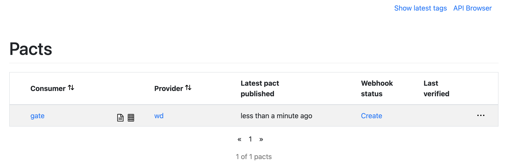

# Setup and run the gate and the wd

## Gate (http://127.0.0.1:5000/user)
```
$ cd gate
$ pip3 install -r requirements.txt
$ python3 src/gate.py
 * Serving Flask app "gate" (lazy loading)
 * Environment: production
   WARNING: This is a development server. Do not use it in a production deployment.
   Use a production WSGI server instead.
 * Debug mode: off
 * Running on http://127.0.0.1:5000/ (Press CTRL+C to quit)
```

## wd (http://127.0.0.1:8080/user)

```
$ cd wd
$ sbt compile run
  [info] welcome to sbt 1.4.6 (Oracle Corporation Java 14.0.2)
  [info] loading global plugins from /Users/glethuillier/.sbt/1.0/plugins
  [info] loading settings for project wd-build from plugins.sbt ...
  [info] loading project definition from /Users/glethuillier/contract-test-poc/wd/project
  [info] loading settings for project root from build.sbt,pact.sbt ...
  [info] set current project to wd (in build file:/Users/glethuillier/contract-test-poc/wd/)
  [info] running com.ledger.QuickstartApp
  SLF4J: Class path contains multiple SLF4J bindings.
  SLF4J: Found binding in [jar:file:/Users/glethuillier/contract-test-poc/wd/target/bg-jobs/sbt_8982dab0/target/a31b0356/97705cb7/logback-classic-1.2.3.jar!/org/slf4j/impl/StaticLoggerBinder.class]
  SLF4J: Found binding in [jar:file:/Users/glethuillier/contract-test-poc/wd/target/bg-jobs/sbt_8982dab0/target/fe4bdae1/9e6c1f2b/slf4j-simple-1.6.4.jar!/org/slf4j/impl/StaticLoggerBinder.class]
  SLF4J: See http://www.slf4j.org/codes.html#multiple_bindings for an explanation.
  SLF4J: Actual binding is of type [ch.qos.logback.classic.util.ContextSelectorStaticBinder]
  SLF4J: A number (1) of logging calls during the initialization phase have been intercepted and are
  SLF4J: now being replayed. These are subject to the filtering rules of the underlying logging system.
  SLF4J: See also http://www.slf4j.org/codes.html#replay
  [2021-02-23 13:33:36,352] [INFO] [akka.event.slf4j.Slf4jLogger] [HelloAkkaHttpServer-akka.actor.default-dispatcher-3] [] - Slf4jLogger started
  [2021-02-23 13:33:38,096] [INFO] [akka.actor.typed.ActorSystem] [HelloAkkaHttpServer-akka.actor.default-dispatcher-5] [] - Server online at http://127.0.0.1:8080/
```

## Perform some requests to the gate

```
$ curl -s -H "Content-type: application/json" -X POST -d '{"name": "Alice", "age": 42}' http://localhost:5000/user | jq
{
  "age": "young",
  "name": "ALICE"
}
$ curl -s -H "Content-type: application/json" -X POST -d '{"name": "Bob", "age": 101}' http://localhost:5000/user | jq
{
  "age": "old",
  "name": "BOB"
}
```

# Verify WD (producer)

## 1. Run Broker
```
$ cd broker
$ docker-compose up
```

Connect to it via the browser: http://localhost/ (use credentials provided in `broker/README.md`)

## 2. Run Gate Tests
```
$ cd gate/tests
$ python -m pytest pact_wd.py
```

The pact is uploaded on the broker:


It can be checked: http://localhost/pacts/provider/wd/consumer/gate/latest

## 3. Verify (passing test)

```
$ cd wd
$ sbt compile run # terminal 1
$ sbt "pactVerify --host localhost --port 8080 --protocol http" # terminal 2
```

## 4. Verify (failing test)

### a) Modify WD to trigger a breach of contract

```
--- a/wd/src/main/scala/com/Ledger/UserRegistry.scala
+++ b/wd/src/main/scala/com/Ledger/UserRegistry.scala
@@ -20,7 +20,7 @@ object UserRegistry {
       case JudgeAge(user, replyTo) =>
         var age = user.age
         var judgement = "young"
-        if (age >= 100) {
+        if (age >= 200) {
           judgement = "old"
         }
         replyTo ! JudgmentPerformed(s"${user.name}", judgement)
```

### b) Compile and Run the provider
```
$ sbt compile run
```

### c) Re-Verify

```
$ cd wd
$ sbt compile run # terminal 1
$ sbt "pactVerify --host localhost --port 8080 --protocol http"
```