# Generate the original pacts and verify both providers

## 0. Run the broker

```
$ cd broker
$ docker-compose up
```

Connect to http://localhost/

(credentials: `README.md` from broker subdirectory)

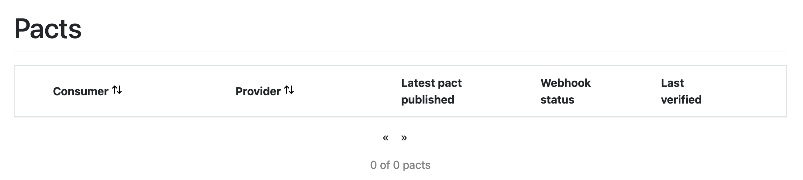

## 1. Generate pact via UI tests (UI expectations)

_(Ensure that the Gate and WD servers are down)._

- UI consumer version: `0.0.1c`
- Gate provider version: **not relevant at this stage**

```
$ cd UI
$ npm test
```

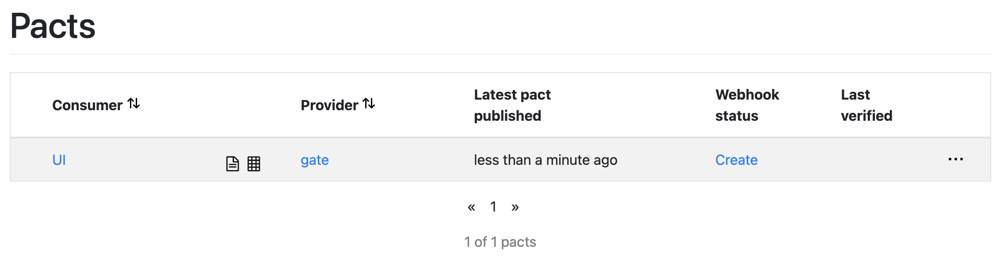

http://localhost/matrix/provider/gate/consumer/UI

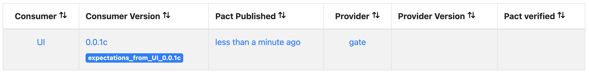

## 2. Verify Gate provider against UI expectations

- UI consumer version: `0.0.1c`
- Gate provider version: `0.0.2p` **(important)**

a) Run both Gate and WD servers

b) Run the verification from anywhere using `pact-provider-verifier`
```
$ pact-provider-verifier --provider-base-url=http://localhost:5000 --pact-broker-base-url=http://localhost --broker-username=pactbroker --broker-password=PoC_P4CT! --provider="gate" --consumer-version-tag="expectations_from_UI_0.0.1c" --publish-verification-results --provider-app-version="0.0.2p"
```

c) The Gate provider is now versionned and the pact, in this context, verified

http://localhost/matrix/provider/gate/consumer/UI

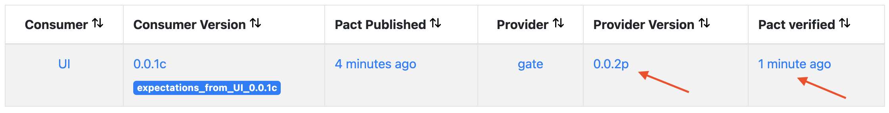

## 3. Generate pact via Gate tests (Gate consumer expectations)

- Gate consumer version: `0.0.2p`
- WD provider version:  **not relevant at this stage**

_(Ensure that the Gate and WD servers are down)._

```
$ cd gate/tests
$ python -m pytest pact_wd.py
```

New contract:

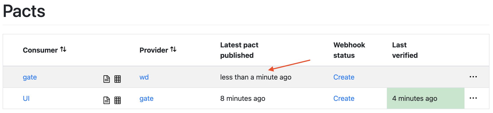

http://localhost/matrix/provider/wd/consumer/gate

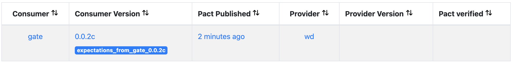

## 4. Verify WD provider against Gate consumer expectations

- Gate consumer version: `0.0.2c`
- WD provider version: `0.0.3p` **(important)**

a) Run both Gate and WD servers

b) Run the verification from anywhere using `pact-provider-verifier`
```
$ pact-provider-verifier --provider-base-url=http://localhost:8080 --pact-broker-base-url=http://localhost --broker-username=pactbroker --broker-password=PoC_P4CT! --provider="wd" --consumer-version-tag="expectations_from_gate_0.0.2c" --publish-verification-results --provider-app-version="0.0.3p"
```

c) The WD provider is now versionned and the pact, in this context, verified

http://localhost/matrix/provider/wd/consumer/gate

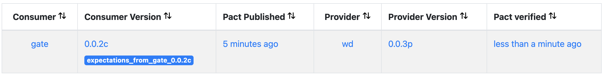

# Change the Gate provider implementation

**Change: the name is no longer capitalized**

a) Modify the way the Gate responds to a request in such a way that it produces a breach of contract. For instance:

```
diff --git a/gate/src/gate.py b/gate/src/gate.py
index c383584..3d6afe7 100644
--- a/gate/src/gate.py
+++ b/gate/src/gate.py
@@ -10,7 +10,7 @@ def request_wd(name, age):
     return req.content.decode('utf-8')

 def capitalize_name(name):
-    return name.upper()
+    return name
```

b) Verify

```
$ pact-provider-verifier --provider-base-url=http://localhost:5000 --pact-broker-base-url=http://localhost --broker-username=pactbroker --broker-password=PoC_P4CT! --provider="gate" --consumer-version-tag="expectations_from_UI_0.0.1c" --publish-verification-results --provider-app-version="0.0.2p"
```

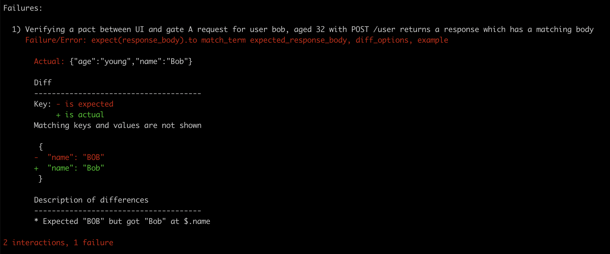

c) From the broker interface:

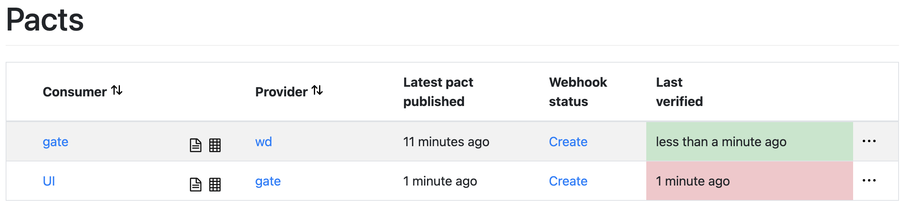


# Change the WD provider implementation

**Change: old when >= 200 years old instead of 100**

a) Modify the way the WD responds to a request in such a way that it produces a breach of contract. For instance:

```
diff --git a/wd/src/main/scala/com/Ledger/UserRegistry.scala b/wd/src/main/scala/com/Ledger/UserRegistry.scala
index 6f506de..788077b 100644
--- a/wd/src/main/scala/com/Ledger/UserRegistry.scala
+++ b/wd/src/main/scala/com/Ledger/UserRegistry.scala
@@ -1,9 +1,7 @@
 package com.ledger

-import akka.actor.typed.ActorRef
-import akka.actor.typed.Behavior
+import akka.actor.typed.{ActorRef, Behavior}
 import akka.actor.typed.scaladsl.Behaviors
-import scala.collection.immutable

 final case class User(name: String, age: Int)

@@ -20,7 +18,7 @@ object UserRegistry {
       case JudgeAge(user, replyTo) =>
         var age = user.age
         var judgement = "young"
-        if (age >= 100) {
+        if (age >= 200) {
           judgement = "old"
         }
         replyTo ! JudgmentPerformed(s"${user.name}", judgement)
```

b) Verify

```
$ pact-provider-verifier --provider-base-url=http://localhost:8080 --pact-broker-base-url=http://localhost --broker-username=pactbroker --broker-password=PoC_P4CT! --provider="wd" --consumer-version-tag="expectations_from_gate_0.0.2c" --publish-verification-results --provider-app-version="0.0.3p"
```

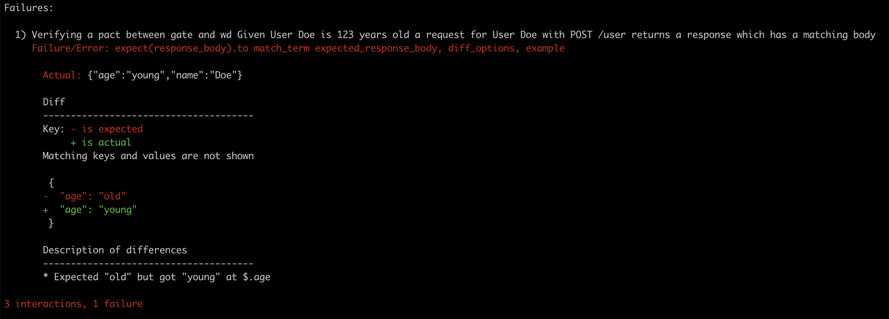

c) From the broker interface:

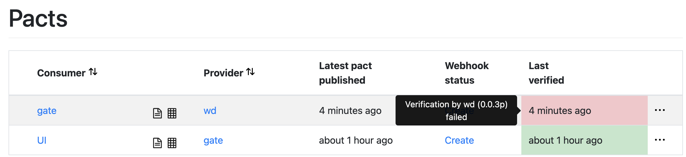
