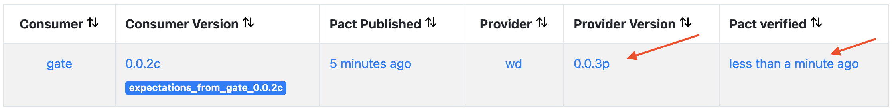

# Generate the original pacts and verify both providers

## 0. Run the broker

```
$ cd broker
$ docker-compose up
```

Connect to http://localhost/

(credentials: `README.md` from broker subdirectory)


## 1. Generate pact via UI tests (UI expectations)

_(Ensure that the Gate and WD servers are down)._

- UI consumer version: `0.0.1c`
- Gate provider version: **not relevant at this stage**

```
$ cd UI
$ npm test
```


http://localhost/matrix/provider/gate/consumer/UI


## 2. Verify Gate provider against UI expectations

- UI consumer version: `0.0.1c`
- Gate provider version: `0.0.2p` **(important)**

a) Run both Gate and WD servers

b) Run the verification from anywhere using `pact-provider-verifier`
```
$ pact-provider-verifier --provider-base-url=http://localhost:5000 --pact-broker-base-url=http://localhost --broker-username=pactbroker --broker-password=PoC_P4CT! --provider="gate" --consumer-version-tag="expectations_from_UI_0.0.1c" --publish-verification-results --provider-app-version="0.0.2p"
```

c) The Gate provider is now versionned and the pact, in this context, verified

http://localhost/matrix/provider/gate/consumer/UI


## 3. Generate pact via Gate tests (Gate consumer expectations)

- Gate consumer version: `0.0.2p`
- WD provider version:  **not relevant at this stage**

_(Ensure that the Gate and WD servers are down)._

```
$ cd gate/tests
$ python -m pytest pact_wd.py
```

New contract:


http://localhost/matrix/provider/wd/consumer/gate


## 4. Verify WD provider against Gate consumer expectations

- Gate consumer version: `0.0.2c`
- WD provider version: `0.0.3p` **(important)**

a) Run both Gate and WD servers

b) Run the verification from anywhere using `pact-provider-verifier`
```
$ pact-provider-verifier --provider-base-url=http://localhost:8080 --pact-broker-base-url=http://localhost --broker-username=pactbroker --broker-password=PoC_P4CT! --provider="wd" --consumer-version-tag="expectations_from_gate_0.0.2c" --publish-verification-results --provider-app-version="0.0.3p"
```

c) The WD provider is now versionned and the pact, in this context, verified

http://localhost/matrix/provider/wd/consumer/gate



# Change the Gate provider implementation

TODO

# Change the WD provider implementation

TODO